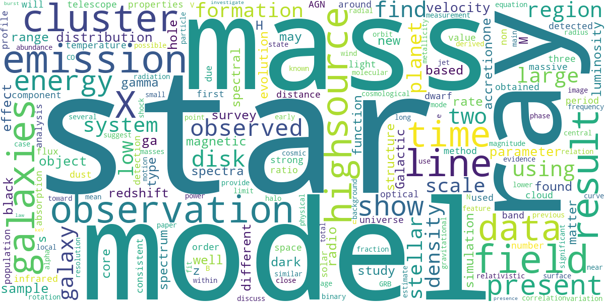
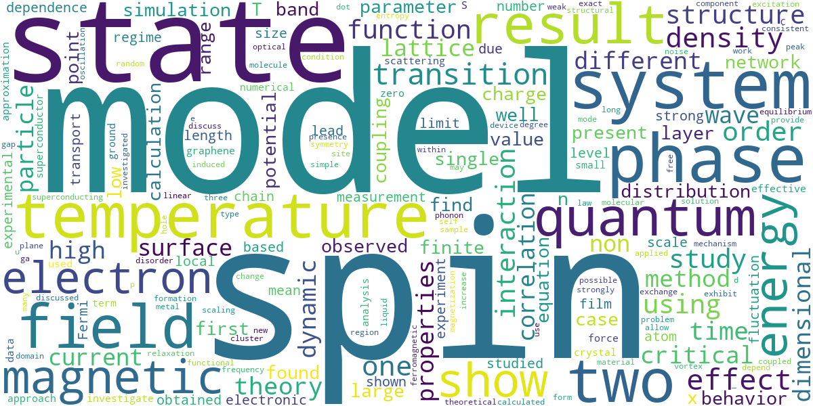
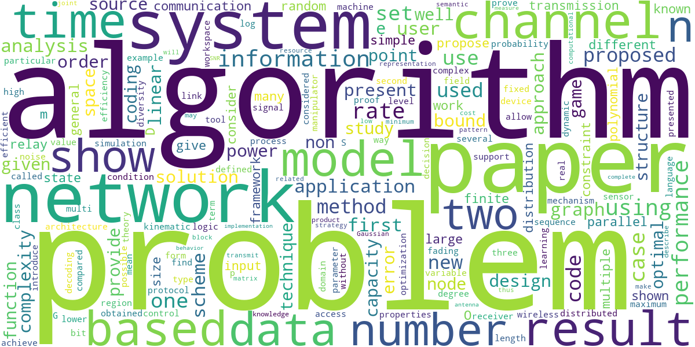
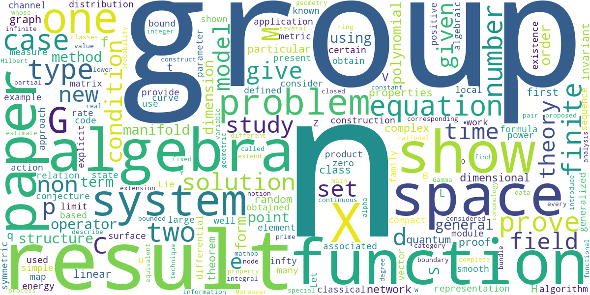
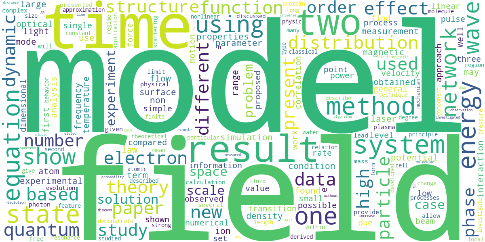

# Scientific Paper Classifier

🇬🇧 English | **[🇻🇳 Bản tiếng Việt](README.vi.md)**

> Automatic classification of scientific papers from arXiv into research fields using Sentence Embeddings and Support Vector Machine.


---

## Summary

The recent explosion of scientific publications has created an urgent need for automatic document organization systems. This project presents a pipeline for classifying scientific papers from the arXiv repository into five major research fields, following a lightweight yet highly effective approach. The method uses **multilingual sentence embeddings** (`intfloat/multilingual-e5-base`) as feature representation, combined with a **Support Vector Machine (SVM)** classifier using an RBF kernel. Experimental results show that dense semantic representations significantly outperform traditional sparse representations (Bag-of-Words), achieving **87.57% accuracy** and **87.53% weighted F1-score** on a balanced test set of 3,500 papers — surpassing the initial target of 85%.

---

## 1. Problem Statement & Motivation

The growth rate of scientific literature is at an unprecedented level. arXiv alone hosts more than **2.2 million preprints** spanning dozens of research fields. Manually labeling and classifying these papers is labor-intensive and hard to scale. An automatic scientific text classification system can:

- **Accelerate document discovery** for researchers entering a new field
- **Serve as a foundation for downstream tasks** such as paper recommendation systems and citation networks
- **Provide a benchmark** for evaluating natural language understanding on dense technical text

The core challenge lies in the concise, terminology-heavy, and often interdisciplinary nature of scientific language, which poses difficulties even for traditional NLP methods. This project investigates the effectiveness of **pretrained multilingual sentence encoders** compared to classical feature extraction (Bag-of-Words) across multiple classifiers, providing both empirical results and full reproducibility.

---

## 2. Data

### 2.1 Data Source

| Field | Detail |
|--------|----------|
| **Dataset** | arXiv Abstracts (arXiv metadata snapshot) |
| **Provider** | UniverseTBD / Cornell University via HuggingFace |
| **Link** | [UniverseTBD/arxiv-abstracts-large](https://huggingface.co/datasets/UniverseTBD/arxiv-abstracts-large) |
| **Total papers** | 2,292,057 |
| **Format** | JSONL — one paper per line |
| **Fields used** | `title`, `abstract`, `categories` |

### 2.2 Label & Sampling Strategy

The original dataset contains **38 categories**. To ensure label balance and focus on the largest fields, a **stratified sampling** strategy was applied: **700 papers/category** were randomly drawn, forming a final training set of **3,500 samples**.

| Category | Description | Original size | Ratio |
|----------|-------|---------------|-------|
| `math` | Mathematics | 461,568 | 20.14% |
| `cs` | Computer Science | 431,766 | 18.84% |
| `cond-mat` | Condensed Matter Physics | 297,127 | 12.96% |
| `astro-ph` | Astrophysics | 285,798 | 12.47% |
| `physics` | General Physics | 163,944 | 7.15% |

> **Note:** Papers with multi-domain labels (e.g., `"cs.LG math.ST"`) are assigned to their *primary category* (the first token).

### 2.3 Data Preprocessing

The preprocessing pipeline was applied to the entire set of 2,292,057 papers before sampling:
- Remove special characters, digits, and extra whitespace
- Convert everything to lowercase
- Extract the primary category from the compound label string
- Concatenate features: `text = title + " " + abstract`
- Results stored in: `data_arxiv_preprocessed.jsonl` with two fields `{text, label}`

---

## 3. Methodology

### 3.1 Feature Extraction

Two different feature extraction strategies were evaluated experimentally:

| Method | Description | Dimensions |
|-------------|-------|----------|
| **Bag-of-Words (BoW)** | Binary `CountVectorizer`, max 5,000 features, n-gram (1, 2) | 5,000 |
| **Sentence Embeddings** | `intfloat/multilingual-e5-base`, L2 normalized | 768 |

**Why `intfloat/multilingual-e5-base`?**
This model was preferred over alternatives (e.g., `all-MiniLM-L6-v2`, `paraphrase-mpnet-base-v2`) because:
1. **Multilingual support** — arXiv abstracts occasionally contain non-English terminology or author names
2. **Dense semantic representation** — E5 is explicitly supervised-trained for text matching, producing a feature space with clearer geometric structure for classification
3. **Balanced size** — 768 dimensions provide strong semantic signal while remaining suitable for kernel-based SVM methods

**Why SVM instead of fine-tuning BERT?**
With a relatively small training set (~3,500 samples), fully fine-tuning a transformer-based classifier carries a high risk of overfitting and requires significantly more computational resources. SVM with an appropriate kernel is well-suited to high-dimensional feature spaces and moderate-sized data, while also offering strong theoretical guarantees (maximum-margin classifier). Combining a fixed pretrained embedding with SVM is a computationally efficient and well-validated baseline.

### 3.2 Classification Pipeline (Final Model)

```
Input: Title + Abstract (raw text)
        │
        ▼
Sentence encoder: intfloat/multilingual-e5-base
        │   → 768-dim vector, L2 normalized
        ▼
SVM classifier: kernel=RBF, C=10.0, gamma=0.1
        │
        ▼
Output label: {astro-ph | cond-mat | cs | math | physics}
```

---

## 4. Experiments

### 4.1 Comparison of 8 Configurations

All models were evaluated on a held-out test set of **200 samples** (40 samples/category), using a stratified split.

| Model | Vectorization | Accuracy | Precision | Recall | F1-Score |
|-------|-----------|----------|-----------|--------|----------|
| **SVM RBF** | **Embeddings** | **0.840** | **0.849** | **0.840** | **0.838** |
| SVM Linear | Embeddings | 0.825 | 0.830 | 0.825 | 0.823 |
| Logistic Regression | Embeddings | 0.790 | 0.780 | 0.790 | 0.783 |
| KNN | Embeddings | 0.775 | 0.781 | 0.775 | 0.763 |
| Logistic Regression | Count | 0.755 | 0.768 | 0.755 | 0.758 |
| SVM RBF | Count | 0.715 | 0.728 | 0.715 | 0.710 |
| SVM Linear | Count | 0.705 | 0.718 | 0.705 | 0.708 |
| KNN | Count | 0.695 | 0.693 | 0.695 | 0.677 |

**Observations:**
- Sentence Embeddings outperform Bag-of-Words across **every** classifier by a margin of **~8–10% accuracy**
- BoW-based models suffer from **severe overfitting** (train–test F1 gap up to 0.29), while Embeddings show a much smaller gap (~0.08), reflecting better representation quality
- **SVM RBF + Embeddings** was selected as the optimal configuration

### 4.2 Hyperparameter Tuning

A grid search with **5-fold cross-validation** was applied to the best configuration (SVM RBF + Embeddings):

```
Search space:
  C           : [0.1, 1.0, 10.0]
  gamma       : ['scale', 0.01, 0.1]
  class_weight: [None, 'balanced']

Best parameters : C=10.0, gamma=0.1, class_weight=None
Best CV F1-score: 0.8414
```

| Metric | Before Tuning | After Tuning | Δ |
|--------|:-----------:|:---------:|:---:|
| Accuracy | 0.840 | **0.845** | +0.5% |
| Precision | 0.849 | **0.854** | +0.5% |
| Recall | 0.840 | **0.845** | +0.5% |
| F1-Score | 0.838 | **0.843** | +0.5% |

### 4.3 Final Model Performance

The final model was retrained on the **full set of 3,500 samples** using the best hyperparameters found above.

#### Overall metrics

| Metric | Value |
|--------|---------|
| Accuracy | **87.57%** |
| F1-Score (weighted) | **87.53%** |

#### Per-class classification report

| Category | Precision | Recall | F1-Score | Support |
|----------|:---------:|:------:|:--------:|:-------:|
| `astro-ph` | 0.93 | 0.94 | 0.93 | 140 |
| `cond-mat` | 0.85 | 0.83 | 0.84 | 140 |
| `cs` | 0.91 | 0.90 | 0.90 | 140 |
| `math` | 0.88 | 0.89 | 0.88 | 140 |
| `physics` | 0.81 | 0.82 | 0.81 | 140 |
| **weighted avg** | **0.88** | **0.88** | **0.88** | **700** |

> `astro-ph` achieves the highest F1 (0.93) thanks to a highly distinctive vocabulary (e.g., *redshift*, *quasar*, *stellar*). `physics` (general) is the hardest label to classify due to semantic overlap with `astro-ph` and `cond-mat`.

---

## 5. Demo Application

A **Streamlit** web application is provided for interactive inference. Users enter a paper's title and abstract to receive an instant classification result.


---

## 6. Project Structure

```
scientific-paper-classifier/
│
├── data/
│   ├── processed/
│   │   ├── data_arxiv_preprocessed.jsonl   # Fully preprocessed corpus
│   │   ├── processed_data.pkl              # Sampled & split training data
│   │   └── metadata.json                   # Run metadata and statistics
│   └── unprocessed/
│       └── arxiv-metadata-oai-snapshot.json  # Raw data (manually downloaded)
│
├── models/
│   ├── svm_model.pkl                       # Trained SVM classifier
│   ├── training_metrics.json               # Evaluation results
│   └── vectorizer_config.json              # Embedding configuration
│
├── notebooks/
│   ├── 1.0-EDA.ipynb                       # Exploratory data analysis
│   ├── 2.0-Data_preprocessing.ipynb        # Full preprocessing pipeline
│   └── 3.0-model-prototyping.ipynb         # Comparison & tuning experiments
│
├── src/
│   ├── data_processing.py                  # Data loading & preprocessing
│   ├── train.py                            # Model training
│   ├── predict.py                          # Inference script
│   └── app.py                              # Streamlit web application
│
├── reports/
│   ├── demo.png
│   └── wordclouds/
│
├── requirements.txt
└── README.md
```

---

## 7. Word Clouds by Field

Visualizations generated during EDA on the entire 2.2-million-paper corpus, providing qualitative evidence of each field's characteristic vocabulary.

| astro-ph | cond-mat | cs |
|:---:|:---:|:---:|
|  |  |  |

| math | physics |
|:---:|:---:|
|  |  |

---

## 8. Limitations & Future Work

### Current Limitations

- **Narrow label scope**: Only covers 5 of arXiv's 38 categories; interdisciplinary papers are forced into a single label
- **Small dataset**: 700 samples/category may not fully represent rare sub-topics within each field
- **No multilingual evaluation**: Despite using a multilingual encoder, all experiments were conducted on English abstracts only
- **Frozen embeddings**: The encoder is frozen; task-specific fine-tuning (e.g., contrastive learning on arXiv paper pairs) could improve representation quality
- **No uncertainty estimation**: The model only produces hard predictions without confidence calibration

### Potential Future Directions

- Fine-tune the sentence encoder end-to-end using contrastive loss on arXiv paper pairs
- Extend classification to all 38 categories using a hierarchical classification architecture
- Explore **SetFit** (few-shot fine-tuning) for low-resource sub-fields
- Integrate with the arXiv API for real-time paper classification

---

## 9. Technology Stack

| Component | Library / Tool |
|------------|-------------------|
| **Sentence encoder** | `sentence-transformers` — `intfloat/multilingual-e5-base` |
| **Classifier** | `scikit-learn` — `SVC` (RBF kernel) |
| **Data loading** | `datasets` (HuggingFace) |
| **Data processing** | `pandas`, `numpy` |
| **Visualization** | `matplotlib`, `seaborn`, `wordcloud` |
| **Web application** | `streamlit` |

---

## 10. Installation & Usage

### Requirements

- Python 3.8+
- Internet connection (first run, to download the embedding model and dataset)

### Environment Setup

```bash
git clone https://gitlab.com/vanan-portfolio/scientific-paper-classifier.git
cd scientific-paper-classifier
python -m venv venv
venv\Scripts\activate        # Windows
# source venv/bin/activate   # Linux/Mac
pip install -r requirements.txt
```

### Option A — Use the pretrained model (Recommended)

```bash
cd src
streamlit run app.py
```

Open `http://localhost:8501`, enter the paper's title and abstract, then click **🔍 Analyze Text**.

### Option B — Retrain from scratch

> Delete `models/svm_model.pkl`, `data/processed/processed_data.pkl`, and `data/processed/metadata.json` before running.

**Step 1 — Process data** (automatically downloads ~3.8 GB from HuggingFace on first run):
```bash
cd src
python data_processing.py
```

**Step 2 — Train the model:**
```bash
python train.py
```

**Step 3 — Evaluate the model:**
```bash
python predict.py
```

**Step 4 — Run the application:**
```bash
streamlit run app.py
```

---

## 11. References

1. Reimers, N., & Gurevych, I. (2019). *Sentence-BERT: Sentence Embeddings using Siamese BERT-Networks*. EMNLP 2019. https://arxiv.org/abs/1908.10084

2. Wang, L., Yang, N., Huang, X., et al. (2022). *Text Embeddings by Weakly-Supervised Contrastive Pre-training*. arXiv preprint. https://arxiv.org/abs/2212.03533

3. Cortes, C., & Vapnik, V. (1995). *Support-vector networks*. Machine Learning, 20(3), 273–297.

4. Clement, C. B., Bierbaum, M., O'Keeffe, K. P., & Alemi, A. A. (2019). *On the Use of arXiv as a Dataset*. arXiv preprint. https://arxiv.org/abs/1905.00075

5. Wolf, T., et al. (2020). *Transformers: State-of-the-Art Natural Language Processing*. EMNLP 2020 (System Demonstrations). https://arxiv.org/abs/1910.03771

---

## License

This project is distributed under the MIT License. See [LICENSE](LICENSE) for details.
